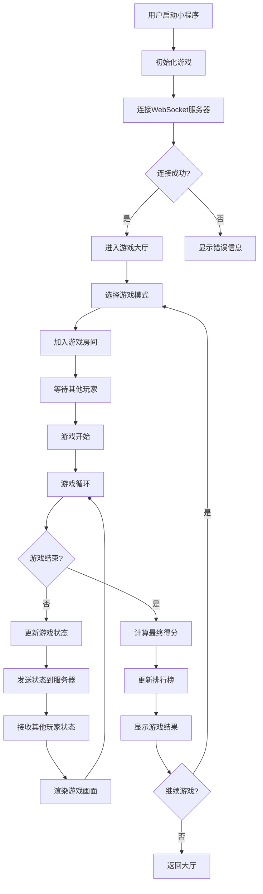
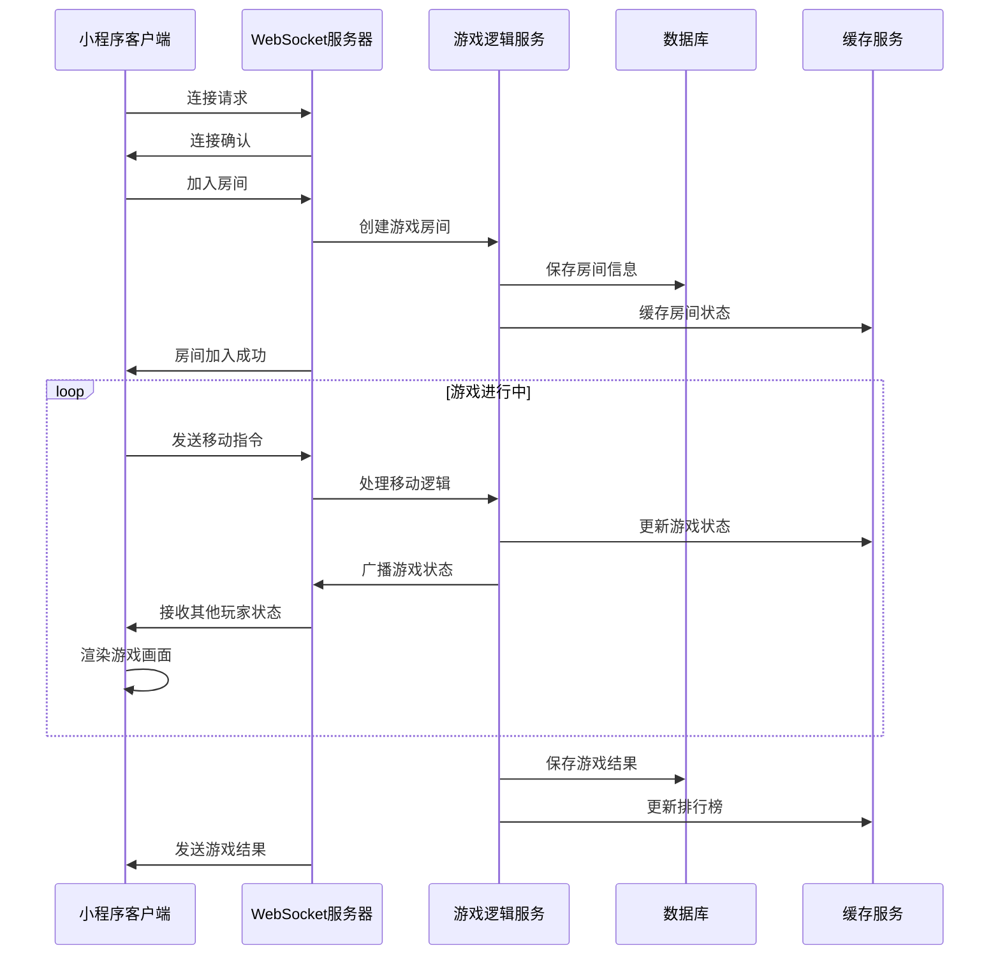
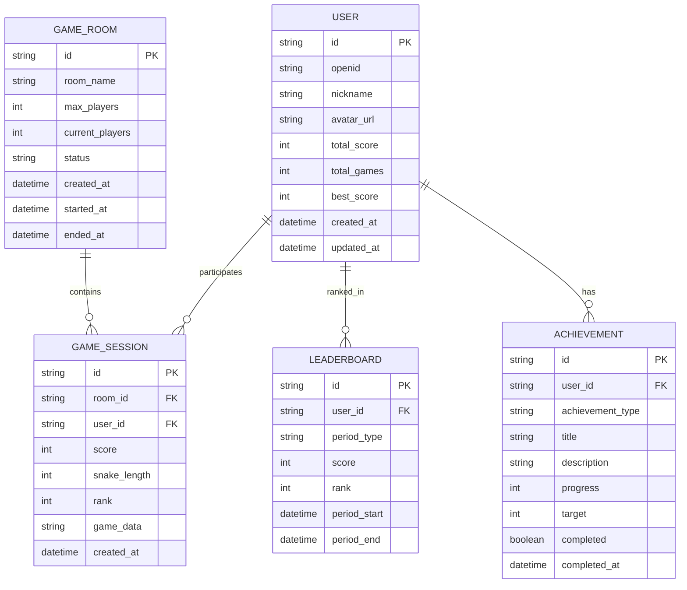

# 🏗️ SnakeSnake 架构设计文档

## 📋 目录

- [系统架构](#系统架构)
- [技术栈](#技术栈)
- [核心设计图](#核心设计图)
- [数据流设计](#数据流设计)
- [模块设计](#模块设计)
- [部署架构](#部署架构)

## 🏛️ 系统架构

### 整体架构图

```
┌─────────────────────────────────────────────────────────────┐
│                     SnakeSnake 系统架构                      │
├─────────────────────────────────────────────────────────────┤
│                                                             │
│  ┌─────────────────┐    ┌─────────────────┐                │
│  │   微信小程序端   │    │    WebSocket     │                │
│  │   (前端)        │◄──►│   服务器         │                │
│  └─────────────────┘    └─────────────────┘                │
│           │                       │                        │
│           │                       │                        │
│  ┌─────────────────┐    ┌─────────────────┐                │
│  │   用户界面层     │    │   游戏逻辑层     │                │
│  │   (UI Layer)    │    │   (Game Logic)  │                │
│  └─────────────────┘    └─────────────────┘                │
│           │                       │                        │
│           │                       │                        │
│  ┌─────────────────┐    ┌─────────────────┐                │
│  │   渲染引擎层     │    │   网络通信层     │                │
│  │  (Canvas API)   │    │  (WebSocket)    │                │
│  └─────────────────┘    └─────────────────┘                │
│                                                             │
│  ┌─────────────────────────────────────────────────────────┐ │
│  │                    后端服务层                            │ │
│  │  ┌─────────────┐ ┌─────────────┐ ┌─────────────┐       │ │
│  │  │ 用户认证服务 │ │ 游戏房间服务 │ │ 排行榜服务   │       │ │
│  │  └─────────────┘ └─────────────┘ └─────────────┘       │ │
│  │  ┌─────────────┐ ┌─────────────┐ ┌─────────────┐       │ │
│  │  │ 数据存储服务 │ │ 消息队列服务 │ │ 监控日志服务 │       │ │
│  │  └─────────────┘ └─────────────┘ └─────────────┘       │ │
│  └─────────────────────────────────────────────────────────┘ │
└─────────────────────────────────────────────────────────────┘
```

### 分层架构

```
┌─────────────────────────────────────────────────────────────┐
│                        表现层 (Presentation Layer)           │
├─────────────────────────────────────────────────────────────┤
│  • 微信小程序页面 (WXML/WXSS)                                │
│  • 用户交互处理                                              │
│  • 界面状态管理                                              │
├─────────────────────────────────────────────────────────────┤
│                        业务层 (Business Layer)               │
├─────────────────────────────────────────────────────────────┤
│  • 游戏逻辑引擎                                              │
│  • 碰撞检测算法                                              │
│  • 得分计算系统                                              │
│  • 排行榜算法                                                │
├─────────────────────────────────────────────────────────────┤
│                        服务层 (Service Layer)                │
├─────────────────────────────────────────────────────────────┤
│  • WebSocket通信服务                                         │
│  • 用户认证服务                                              │
│  • 数据持久化服务                                            │
│  • 实时消息服务                                              │
├─────────────────────────────────────────────────────────────┤
│                        数据层 (Data Layer)                   │
├─────────────────────────────────────────────────────────────┤
│  • 本地存储 (Storage)                                        │
│  • 远程数据库 (MongoDB/MySQL)                                │
│  • 缓存服务 (Redis)                                          │
│  • 文件存储 (OSS/COS)                                        │
└─────────────────────────────────────────────────────────────┘
```

## 🛠️ 技术栈

### 前端技术栈
- **框架**: 微信小程序原生开发
- **渲染**: Canvas API
- **通信**: WebSocket
- **状态管理**: 小程序原生状态管理
- **样式**: WXSS (类似CSS)
- **模板**: WXML (类似HTML)

### 后端技术栈推荐
- **WebSocket服务器**: Socket.IO / ws
- **API服务器**: Express.js / Koa.js / Fastify
- **数据库**: MongoDB / MySQL / PostgreSQL
- **缓存**: Redis
- **消息队列**: RabbitMQ / Redis Pub/Sub
- **部署**: Docker + Kubernetes / 云服务

## 🎨 核心设计图

### 游戏流程图



### 数据流图



### 组件关系图

```
┌─────────────────────────────────────────────────────────────┐
│                    SnakeSnake 组件架构                       │
├─────────────────────────────────────────────────────────────┤
│                                                             │
│  ┌─────────────────┐    ┌─────────────────┐                │
│  │     App.js      │    │   Global Data   │                │
│  │   (应用入口)     │◄──►│   (全局数据)     │                │
│  └─────────────────┘    └─────────────────┘                │
│           │                       │                        │
│           ▼                       ▼                        │
│  ┌─────────────────────────────────────────────────────────┐ │
│  │                    页面组件                              │ │
│  │  ┌─────────────┐ ┌─────────────┐ ┌─────────────┐       │ │
│  │  │   Index     │ │    Game     │ │    Rank     │       │ │
│  │  │  (首页)     │ │   (游戏)    │ │  (排行榜)   │       │ │
│  │  └─────────────┘ └─────────────┘ └─────────────┘       │ │
│  │  ┌─────────────┐                                       │ │
│  │  │   Profile   │                                       │ │
│  │  │ (个人资料)   │                                       │ │
│  │  └─────────────┘                                       │ │
│  └─────────────────────────────────────────────────────────┘ │
│                                                             │
│  ┌─────────────────────────────────────────────────────────┐ │
│  │                    游戏引擎                              │ │
│  │  ┌─────────────┐ ┌─────────────┐ ┌─────────────┐       │ │
│  │  │ Game Loop   │ │ Collision   │ │ Render      │       │ │
│  │  │ (游戏循环)   │ │ Detection   │ │ (渲染引擎)   │       │ │
│  │  │             │ │ (碰撞检测)   │ │ (渲染引擎)   │       │ │
│  │  └─────────────┘ └─────────────┘ └─────────────┘       │ │
│  │  ┌─────────────┐ ┌─────────────┐ ┌─────────────┐       │ │
│  │  │ Score       │ │ Ranking     │ │ Network     │       │ │
│  │  │ System      │ │ System      │ │ Manager     │       │ │
│  │  │ (得分系统)   │ │ (排行榜)    │ │ (网络管理)   │       │ │
│  │  └─────────────┘ └─────────────┘ └─────────────┘       │ │
│  └─────────────────────────────────────────────────────────┘ │
└─────────────────────────────────────────────────────────────┘
```

### 数据库设计图



## 🔄 数据流设计

### 实时数据流

```
客户端 ←→ WebSocket服务器 ←→ 游戏逻辑服务 ←→ 数据存储
   ↑              ↑              ↑              ↑
   │              │              │              │
   ▼              ▼              ▼              ▼
本地缓存     消息队列        业务逻辑        持久化存储
```

### 数据同步策略

1. **状态同步**: 游戏状态通过WebSocket实时同步
2. **增量更新**: 只传输变化的数据，减少网络开销
3. **冲突解决**: 服务器权威，客户端状态以服务器为准
4. **断线重连**: 支持断线重连，恢复游戏状态

## 🧩 模块设计

### 核心模块

#### 1. 游戏引擎模块
- **职责**: 游戏逻辑处理、状态管理
- **接口**: 
  - `initGame()`: 初始化游戏
  - `updateGame()`: 更新游戏状态
  - `renderGame()`: 渲染游戏画面
  - `handleInput()`: 处理用户输入

#### 2. 网络通信模块
- **职责**: WebSocket连接管理、消息处理
- **接口**:
  - `connect()`: 建立连接
  - `sendMessage()`: 发送消息
  - `onMessage()`: 接收消息
  - `disconnect()`: 断开连接

#### 3. 排行榜模块
- **职责**: 分数计算、排名更新
- **接口**:
  - `updateScore()`: 更新分数
  - `getRanking()`: 获取排名
  - `getLeaderboard()`: 获取排行榜

#### 4. 成就系统模块
- **职责**: 成就检测、进度跟踪
- **接口**:
  - `checkAchievement()`: 检查成就
  - `updateProgress()`: 更新进度
  - `getAchievements()`: 获取成就列表

### 模块依赖关系

```
App.js
├── GameEngine
│   ├── CollisionDetector
│   ├── ScoreCalculator
│   └── StateManager
├── NetworkManager
│   ├── WebSocketClient
│   └── MessageHandler
├── RankingSystem
│   ├── ScoreTracker
│   └── LeaderboardManager
└── AchievementSystem
    ├── AchievementChecker
    └── ProgressTracker
```

## 🚀 部署架构

### 开发环境
```
┌─────────────────┐    ┌─────────────────┐
│  微信开发者工具   │    │   本地服务器     │
│   (前端调试)     │◄──►│   (后端开发)     │
└─────────────────┘    └─────────────────┘
```

### 测试环境
```
┌─────────────────┐    ┌─────────────────┐    ┌─────────────────┐
│   测试小程序     │    │   测试服务器     │    │   测试数据库     │
│   (Staging)     │◄──►│   (Test API)    │◄──►│   (Test DB)     │
└─────────────────┘    └─────────────────┘    └─────────────────┘
```

### 生产环境
```
┌─────────────────┐    ┌─────────────────┐    ┌─────────────────┐
│   生产小程序     │    │   负载均衡器     │    │   应用服务器集群  │
│   (Production)  │◄──►│   (Nginx/LB)    │◄──►│   (App Servers) │
└─────────────────┘    └─────────────────┘    └─────────────────┘
                                                       │
                                              ┌─────────────────┐
                                              │   数据库集群     │
                                              │   (DB Cluster)  │
                                              └─────────────────┘
```

## 📊 性能指标

### 目标性能
- **响应时间**: < 100ms
- **并发用户**: 1000+
- **游戏延迟**: < 50ms
- **可用性**: 99.9%

### 监控指标
- **服务器性能**: CPU、内存、网络
- **游戏性能**: FPS、延迟、丢包率
- **用户体验**: 加载时间、响应时间
- **业务指标**: 在线用户数、游戏局数

## 🔒 安全设计

### 安全措施
1. **用户认证**: 微信授权登录
2. **数据验证**: 服务器端数据验证
3. **防作弊**: 服务器权威验证
4. **数据加密**: 敏感数据加密存储
5. **访问控制**: 基于角色的权限控制

### 安全架构
```
客户端 ←→ HTTPS/WSS ←→ 网关 ←→ 应用服务 ←→ 数据库
   ↑         ↑         ↑         ↑         ↑
   │         │         │         │         │
   ▼         ▼         ▼         ▼         ▼
本地验证   传输加密   访问控制   业务验证   数据加密
```

---

**注意**: 本文档描述了SnakeSnake项目的整体架构设计，为开发团队提供技术指导。 