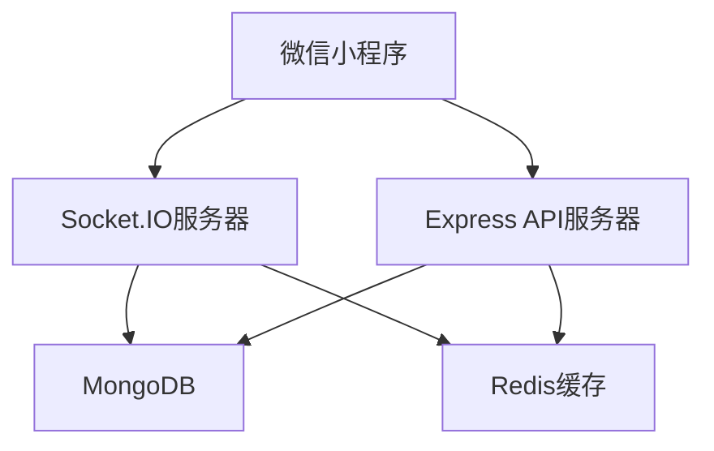
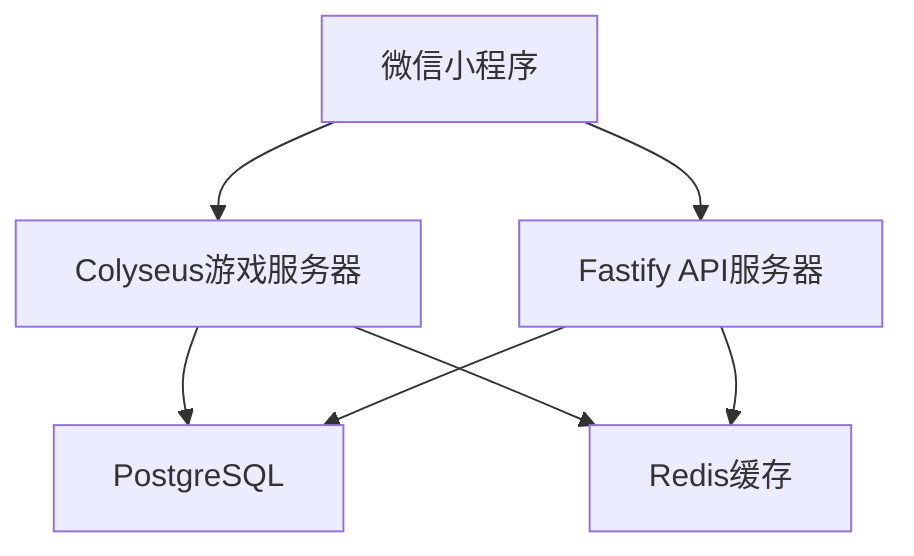
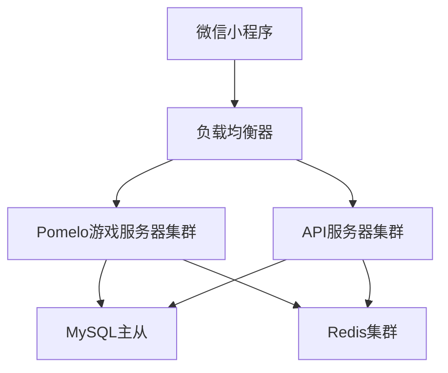

# 🚀 SnakeSnake 后端实现推荐

## 📋 目录

- [技术栈选择](#技术栈选择)
- [开源项目推荐](#开源项目推荐)
- [架构方案](#架构方案)
- [部署方案](#部署方案)
- [开发指南](#开发指南)
- [SnakeSnake 特定实现](#snakesnake-特定实现)

## 🛠️ 技术栈选择

### 推荐技术栈

#### 1. WebSocket服务器

- **Socket.IO**: 最流行的WebSocket库，支持自动重连、房间管理
- **ws**: 轻量级WebSocket库，性能优秀
- **Fastify**: 高性能的Web框架，内置WebSocket支持

#### 2. API服务器

- **Express.js**: 最流行的Node.js Web框架
- **Koa.js**: 轻量级、现代化的Web框架
- **Fastify**: 高性能的Web框架
- **NestJS**: 企业级Node.js框架，支持TypeScript

#### 3. 数据库

- **MongoDB**: 文档型数据库，适合游戏数据存储
- **MySQL**: 关系型数据库，成熟稳定
- **PostgreSQL**: 功能强大的关系型数据库
- **Redis**: 内存数据库，用于缓存和会话存储

#### 4. 消息队列

- **Redis Pub/Sub**: 轻量级消息队列
- **RabbitMQ**: 功能强大的消息队列
- **Apache Kafka**: 高吞吐量的消息队列

## 🔗 开源项目推荐

### WebSocket游戏服务器

#### 1. [Socket.IO Game Server](https://github.com/socketio/socket.io-game-server)

**推荐指数**: ⭐⭐⭐⭐⭐

**特点**:

- 基于Socket.IO的完整游戏服务器
- 支持房间管理、玩家匹配
- 内置断线重连机制
- 丰富的文档和示例

**适用场景**: 多人在线游戏、实时通信

**快速开始**:

```bash
git clone https://github.com/socketio/socket.io-game-server.git
cd socket.io-game-server
npm install
npm start
```

#### 2. [Colyseus](https://github.com/colyseus/colyseus)

**推荐指数**: ⭐⭐⭐⭐⭐

**特点**:

- 专门为游戏设计的实时服务器框架
- 支持TypeScript
- 内置房间管理、状态同步
- 优秀的性能和可扩展性

**适用场景**: 实时多人游戏、状态同步

**快速开始**:

```bash
npm install colyseus
npx colyseus-app init my-game
cd my-game
npm start
```

#### 3. [Pomelo](https://github.com/NetEase/pomelo)

**推荐指数**: ⭐⭐⭐⭐

**特点**:

- 网易开源的分布式游戏服务器框架
- 支持集群部署
- 丰富的游戏服务器功能
- 中文文档完善

**适用场景**: 大型多人在线游戏

### API服务器框架

#### 1. [Express.js](https://github.com/expressjs/express)

**推荐指数**: ⭐⭐⭐⭐⭐

**特点**:

- 最流行的Node.js Web框架
- 丰富的中间件生态
- 简单易学，文档完善
- 社区活跃

**快速开始**:

```bash
npm install express
```

#### 2. [Fastify](https://github.com/fastify/fastify)

**推荐指数**: ⭐⭐⭐⭐⭐

**特点**:

- 高性能的Web框架
- 内置WebSocket支持
- 优秀的TypeScript支持
- 低内存占用

**快速开始**:

```bash
npm install fastify
```

#### 3. [NestJS](https://github.com/nestjs/nest)

**推荐指数**: ⭐⭐⭐⭐

**特点**:

- 企业级Node.js框架
- 支持TypeScript
- 依赖注入、装饰器等现代特性
- 模块化架构

**快速开始**:

```bash
npm install -g @nestjs/cli
nest new my-app
```

### 数据库解决方案

#### 1. [MongoDB](https://github.com/mongodb/mongo)

**推荐指数**: ⭐⭐⭐⭐⭐

**特点**:

- 文档型数据库，适合游戏数据
- 支持复杂查询
- 水平扩展能力强
- 丰富的驱动支持

**快速开始**:

```bash
# 使用Docker
docker run -d -p 27017:27017 --name mongodb mongo:latest
```

#### 2. [Redis](https://github.com/redis/redis)

**推荐指数**: ⭐⭐⭐⭐⭐

**特点**:

- 内存数据库，性能极高
- 支持多种数据结构
- 内置发布订阅功能
- 适合缓存和会话存储

**快速开始**:

```bash
# 使用Docker
docker run -d -p 6379:6379 --name redis redis:latest
```

### 完整解决方案

#### 1. [Game Server Kit](https://github.com/game-server-kit/game-server-kit)

**推荐指数**: ⭐⭐⭐⭐

**特点**:

- 完整的游戏服务器解决方案
- 包含用户认证、房间管理、排行榜
- 支持多种数据库
- 开箱即用

#### 2. [Agora Gaming](https://github.com/AgoraIO/Agora-Gaming-SDK)

**推荐指数**: ⭐⭐⭐⭐

**特点**:

- 专业的游戏通信解决方案
- 支持音视频通信
- 全球CDN网络
- 低延迟、高并发

## 🏗️ 架构方案

### 方案一：Socket.IO + Express + MongoDB



**优势**:

- 技术栈成熟，社区支持好
- 开发效率高
- 易于扩展和维护

**适用场景**: 中小型游戏项目

### 方案二：Colyseus + Fastify + PostgreSQL



**优势**:

- 专门为游戏设计
- 性能优秀
- 支持复杂游戏逻辑

**适用场景**: 大型多人在线游戏

### 方案三：Pomelo + 分布式架构



**优势**:

- 支持大规模并发
- 高可用性
- 易于水平扩展

**适用场景**: 超大型游戏项目

## 🚀 SnakeSnake 特定实现

### 推荐架构：Socket.IO + Express + MongoDB

基于SnakeSnake的游戏特点，推荐使用以下架构：

#### 1. 服务器架构

```javascript
// 项目结构
snakesnake-server/
├── src/
│   ├── server.js          # 主服务器入口
│   ├── socket/            # WebSocket处理
│   │   ├── gameHandler.js # 游戏逻辑处理
│   │   ├── roomManager.js # 房间管理
│   │   └── playerManager.js # 玩家管理
│   ├── api/               # REST API
│   │   ├── auth.js        # 用户认证
│   │   ├── ranking.js     # 排行榜API
│   │   └── stats.js       # 统计API
│   ├── models/            # 数据模型
│   │   ├── User.js        # 用户模型
│   │   ├── Game.js        # 游戏模型
│   │   └── Ranking.js     # 排行榜模型
│   └── utils/             # 工具函数
├── package.json
└── docker-compose.yml
```

#### 2. 核心功能实现

**游戏房间管理**:

```javascript
// roomManager.js
class RoomManager {
  constructor() {
    this.rooms = new Map()
    this.maxPlayers = 20
  }

  createRoom(roomId) {
    const room = {
      id: roomId,
      players: new Map(),
      gameState: 'waiting',
      gifts: [],
      blackHoles: [],
      startTime: null
    }
    this.rooms.set(roomId, room)
    return room
  }

  joinRoom(roomId, player) {
    const room = this.rooms.get(roomId)
    if (room && room.players.size < this.maxPlayers) {
      room.players.set(player.id, player)
      return true
    }
    return false
  }
}
```

**游戏状态同步**:

```javascript
// gameHandler.js
class GameHandler {
  constructor(io, roomManager) {
    this.io = io
    this.roomManager = roomManager
  }

  handlePlayerMove(socket, data) {
    const { roomId, playerId, direction } = data
    const room = this.roomManager.rooms.get(roomId)

    if (room) {
      // 更新玩家位置
      const player = room.players.get(playerId)
      if (player) {
        player.direction = direction
        player.position = this.calculateNewPosition(player.position, direction)

        // 检查碰撞
        if (this.checkCollision(player, room)) {
          this.endGame(roomId, playerId)
        } else {
          // 广播游戏状态
          this.broadcastGameState(roomId)
        }
      }
    }
  }
}
```

#### 3. 数据库设计

**用户表 (users)**:

```javascript
{
  _id: ObjectId,
  openid: String,          // 微信openid
  nickname: String,        // 昵称
  avatar: String,          // 头像
  totalGames: Number,      // 总游戏数
  totalScore: Number,      // 总分数
  highestScore: Number,    // 最高分
  winRate: Number,         // 胜率
  achievements: Array,     // 成就列表
  createdAt: Date,
  updatedAt: Date
}
```

**游戏记录表 (games)**:

```javascript
{
  _id: ObjectId,
  roomId: String,          // 房间ID
  players: Array,          // 玩家列表
  winner: ObjectId,        // 获胜者ID
  scores: Array,           // 分数列表
  duration: Number,        // 游戏时长
  giftsCollected: Number,  // 收集礼包数
  blackHolesHit: Number,   // 碰到黑洞数
  createdAt: Date
}
```

**排行榜表 (rankings)**:

```javascript
{
  _id: ObjectId,
  type: String,            // 排行榜类型 (daily, weekly, monthly, total)
  date: Date,              // 统计日期
  rankings: Array,         // 排名列表
  updatedAt: Date
}
```

#### 4. API接口设计

**用户认证**:

```javascript
// POST /api/auth/login
{
  "code": "微信登录code",
  "userInfo": {
    "nickName": "用户昵称",
    "avatarUrl": "头像URL"
  }
}

// 响应
{
  "success": true,
  "token": "JWT token",
  "user": {
    "id": "用户ID",
    "nickname": "昵称",
    "avatar": "头像"
  }
}
```

**排行榜API**:

```javascript
// GET /api/ranking/:type?page=1&limit=20
// 响应
{
  "success": true,
  "data": {
    "rankings": [
      {
        "rank": 1,
        "userId": "用户ID",
        "nickname": "昵称",
        "avatar": "头像",
        "score": 10000
      }
    ],
    "pagination": {
      "page": 1,
      "limit": 20,
      "total": 100
    }
  }
}
```

#### 5. WebSocket事件

**客户端事件**:

```javascript
// 加入房间
socket.emit('joinRoom', { roomId: 'room1' })

// 发送移动指令
socket.emit('playerMove', {
  roomId: 'room1',
  direction: 'up'
})

// 收集礼包
socket.emit('collectGift', {
  roomId: 'room1',
  giftId: 'gift1'
})
```

**服务器事件**:

```javascript
// 游戏状态更新
socket.on('gameStateUpdate', data => {
  // 更新游戏画面
})

// 玩家加入/离开
socket.on('playerJoined', player => {
  // 显示新玩家
})

// 游戏结束
socket.on('gameEnd', result => {
  // 显示游戏结果
})
```

## 🚀 部署方案

### Docker部署

```yaml
# docker-compose.yml
version: '3.8'
services:
  game-server:
    build: .
    ports:
      - '3000:3000'
    environment:
      - NODE_ENV=production
      - MONGODB_URI=mongodb://mongo:27017/snakesnake
      - REDIS_URI=redis://redis:6379
    depends_on:
      - mongo
      - redis

  mongo:
    image: mongo:latest
    ports:
      - '27017:27017'
    volumes:
      - mongo_data:/data/db

  redis:
    image: redis:latest
    ports:
      - '6379:6379'
    volumes:
      - redis_data:/data

volumes:
  mongo_data:
  redis_data:
```

### 云服务部署

**推荐云服务**:

- **阿里云**: 国内访问速度快，支持微信小程序
- **腾讯云**: 微信生态集成好
- **AWS**: 全球部署，功能丰富
- **Google Cloud**: 性能优秀，价格合理

## 📚 开发指南

### 1. 环境搭建

```bash
# 克隆项目
git clone https://github.com/zsjohny/snakesnake-server.git
cd snakesnake-server

# 安装依赖
npm install

# 配置环境变量
cp .env.example .env
# 编辑 .env 文件

# 启动开发服务器
npm run dev
```

### 2. 开发流程

1. **功能开发**: 在 `src/` 目录下开发新功能
2. **测试**: 使用 `npm test` 运行测试
3. **代码检查**: 使用 `npm run lint` 检查代码质量
4. **部署**: 使用 Docker 或云服务部署

### 3. 性能优化

- **连接池**: 使用数据库连接池
- **缓存**: 合理使用Redis缓存
- **负载均衡**: 使用Nginx进行负载均衡
- **监控**: 集成监控和日志系统

### 4. 安全考虑

- **输入验证**: 验证所有用户输入
- **身份认证**: 使用JWT进行身份认证
- **数据加密**: 敏感数据加密存储
- **限流**: 实现API限流机制

## 🔗 相关资源

- [Socket.IO 官方文档](https://socket.io/docs/)
- [Express.js 官方文档](https://expressjs.com/)
- [MongoDB 官方文档](https://docs.mongodb.com/)
- [Redis 官方文档](https://redis.io/documentation)
- [微信小程序开发文档](https://developers.weixin.qq.com/miniprogram/dev/framework/)

## 📞 技术支持

如有技术问题，请通过以下方式联系：

- **GitHub Issues**: [https://github.com/zsjohny/snakesnake/issues](https://github.com/zsjohny/snakesnake/issues)
- **邮箱**: zs.johny@163.com
- **作者**: JohnyZheng

---

_最后更新时间: 2024年12月_
