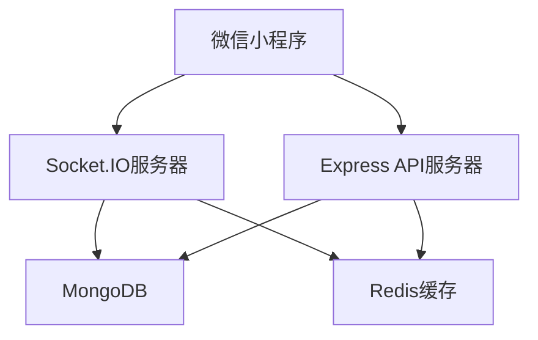
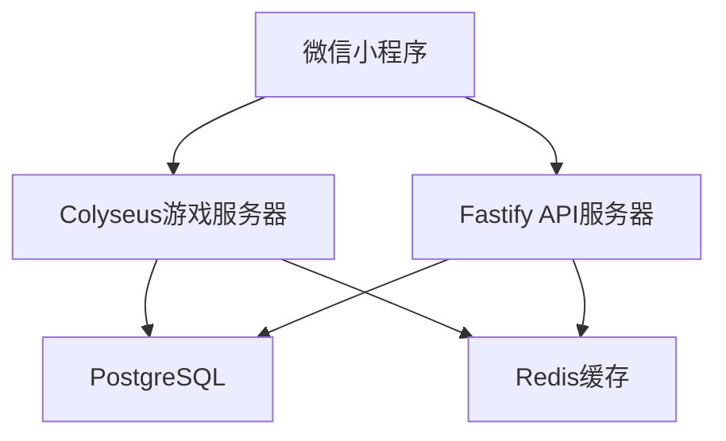
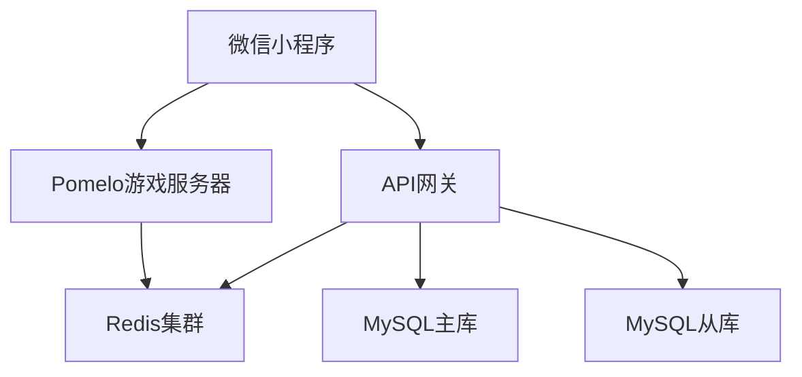

# 🚀 SnakeSnake 后端实现推荐

## 📋 目录

- [技术栈选择](#技术栈选择)
- [开源项目推荐](#开源项目推荐)
- [架构方案](#架构方案)
- [部署方案](#部署方案)
- [开发指南](#开发指南)

## 🛠️ 技术栈选择

### 推荐技术栈

#### 1. WebSocket服务器
- **Socket.IO**: 最流行的WebSocket库，支持自动重连、房间管理
- **ws**: 轻量级WebSocket库，性能优秀
- **Fastify**: 高性能的Web框架，内置WebSocket支持

#### 2. API服务器
- **Express.js**: 最流行的Node.js Web框架
- **Koa.js**: 轻量级、现代化的Web框架
- **Fastify**: 高性能的Web框架
- **NestJS**: 企业级Node.js框架，支持TypeScript

#### 3. 数据库
- **MongoDB**: 文档型数据库，适合游戏数据存储
- **MySQL**: 关系型数据库，成熟稳定
- **PostgreSQL**: 功能强大的关系型数据库
- **Redis**: 内存数据库，用于缓存和会话存储

#### 4. 消息队列
- **Redis Pub/Sub**: 轻量级消息队列
- **RabbitMQ**: 功能强大的消息队列
- **Apache Kafka**: 高吞吐量的消息队列

## 🔗 开源项目推荐

### WebSocket游戏服务器

#### 1. [Socket.IO Game Server](https://github.com/socketio/socket.io-game-server)
**推荐指数**: ⭐⭐⭐⭐⭐

**特点**:
- 基于Socket.IO的完整游戏服务器
- 支持房间管理、玩家匹配
- 内置断线重连机制
- 丰富的文档和示例

**适用场景**: 多人在线游戏、实时通信

**快速开始**:
```bash
git clone https://github.com/socketio/socket.io-game-server.git
cd socket.io-game-server
npm install
npm start
```

#### 2. [Colyseus](https://github.com/colyseus/colyseus)
**推荐指数**: ⭐⭐⭐⭐⭐

**特点**:
- 专门为游戏设计的实时服务器框架
- 支持TypeScript
- 内置房间管理、状态同步
- 优秀的性能和可扩展性

**适用场景**: 实时多人游戏、状态同步

**快速开始**:
```bash
npm install colyseus
npx colyseus-app init my-game
cd my-game
npm start
```

#### 3. [Pomelo](https://github.com/NetEase/pomelo)
**推荐指数**: ⭐⭐⭐⭐

**特点**:
- 网易开源的分布式游戏服务器框架
- 支持集群部署
- 丰富的游戏服务器功能
- 中文文档完善

**适用场景**: 大型多人在线游戏

### API服务器框架

#### 1. [Express.js](https://github.com/expressjs/express)
**推荐指数**: ⭐⭐⭐⭐⭐

**特点**:
- 最流行的Node.js Web框架
- 丰富的中间件生态
- 简单易学，文档完善
- 社区活跃

**快速开始**:
```bash
npm install express
```

#### 2. [Fastify](https://github.com/fastify/fastify)
**推荐指数**: ⭐⭐⭐⭐⭐

**特点**:
- 高性能的Web框架
- 内置WebSocket支持
- 优秀的TypeScript支持
- 低内存占用

**快速开始**:
```bash
npm install fastify
```

#### 3. [NestJS](https://github.com/nestjs/nest)
**推荐指数**: ⭐⭐⭐⭐

**特点**:
- 企业级Node.js框架
- 支持TypeScript
- 依赖注入、装饰器等现代特性
- 模块化架构

**快速开始**:
```bash
npm install -g @nestjs/cli
nest new my-app
```

### 数据库解决方案

#### 1. [MongoDB](https://github.com/mongodb/mongo)
**推荐指数**: ⭐⭐⭐⭐⭐

**特点**:
- 文档型数据库，适合游戏数据
- 支持复杂查询
- 水平扩展能力强
- 丰富的驱动支持

**快速开始**:
```bash
# 使用Docker
docker run -d -p 27017:27017 --name mongodb mongo:latest
```

#### 2. [Redis](https://github.com/redis/redis)
**推荐指数**: ⭐⭐⭐⭐⭐

**特点**:
- 内存数据库，性能极高
- 支持多种数据结构
- 内置发布订阅功能
- 适合缓存和会话存储

**快速开始**:
```bash
# 使用Docker
docker run -d -p 6379:6379 --name redis redis:latest
```

### 完整解决方案

#### 1. [Game Server Kit](https://github.com/game-server-kit/game-server-kit)
**推荐指数**: ⭐⭐⭐⭐

**特点**:
- 完整的游戏服务器解决方案
- 包含用户认证、房间管理、排行榜
- 支持多种数据库
- 开箱即用

#### 2. [Agora Gaming](https://github.com/AgoraIO/Agora-Gaming-SDK)
**推荐指数**: ⭐⭐⭐⭐

**特点**:
- 专业的游戏通信解决方案
- 支持音视频通信
- 全球CDN网络
- 低延迟、高并发

## 🏗️ 架构方案

### 方案一：Socket.IO + Express + MongoDB



**优势**:
- 技术栈成熟，文档丰富
- 开发效率高
- 社区支持好
- 易于扩展

**适用场景**: 中小型游戏，快速开发

### 方案二：Colyseus + Fastify + PostgreSQL



**优势**:
- 性能优秀
- 类型安全
- 架构清晰
- 适合大型项目

**适用场景**: 大型游戏，高性能要求

### 方案三：Pomelo + MySQL + Redis



**优势**:
- 分布式架构
- 高可用性
- 支持集群部署
- 企业级特性

**适用场景**: 大型多人在线游戏

## 🚀 部署方案

### Docker部署

#### 1. 单机部署
```yaml
# docker-compose.yml
version: '3.8'
services:
  game-server:
    image: snakesnake/game-server:latest
    ports:
      - "3000:3000"
    environment:
      - NODE_ENV=production
      - MONGODB_URI=mongodb://mongo:27017/snakesnake
      - REDIS_URI=redis://redis:6379
    depends_on:
      - mongo
      - redis

  api-server:
    image: snakesnake/api-server:latest
    ports:
      - "3001:3001"
    environment:
      - NODE_ENV=production
      - MONGODB_URI=mongodb://mongo:27017/snakesnake
      - REDIS_URI=redis://redis:6379
    depends_on:
      - mongo
      - redis

  mongo:
    image: mongo:latest
    ports:
      - "27017:27017"
    volumes:
      - mongo_data:/data/db

  redis:
    image: redis:latest
    ports:
      - "6379:6379"
    volumes:
      - redis_data:/data

volumes:
  mongo_data:
  redis_data:
```

#### 2. 集群部署
```yaml
# docker-compose.cluster.yml
version: '3.8'
services:
  game-server:
    image: snakesnake/game-server:latest
    deploy:
      replicas: 3
    environment:
      - NODE_ENV=production
      - MONGODB_URI=mongodb://mongo:27017/snakesnake
      - REDIS_URI=redis://redis:6379

  api-server:
    image: snakesnake/api-server:latest
    deploy:
      replicas: 2
    environment:
      - NODE_ENV=production
      - MONGODB_URI=mongodb://mongo:27017/snakesnake
      - REDIS_URI=redis://redis:6379

  nginx:
    image: nginx:latest
    ports:
      - "80:80"
      - "443:443"
    volumes:
      - ./nginx.conf:/etc/nginx/nginx.conf
```

### 云服务部署

#### 1. 阿里云
- **ECS**: 云服务器
- **RDS**: 数据库服务
- **Redis**: 缓存服务
- **SLB**: 负载均衡
- **OSS**: 对象存储

#### 2. 腾讯云
- **CVM**: 云服务器
- **TencentDB**: 数据库服务
- **Redis**: 缓存服务
- **CLB**: 负载均衡
- **COS**: 对象存储

#### 3. AWS
- **EC2**: 云服务器
- **RDS**: 数据库服务
- **ElastiCache**: 缓存服务
- **ALB**: 负载均衡
- **S3**: 对象存储

## 📚 开发指南

### 快速开始

#### 1. 使用Socket.IO
```javascript
// server.js
const express = require('express')
const { createServer } = require('http')
const { Server } = require('socket.io')

const app = express()
const server = createServer(app)
const io = new Server(server, {
  cors: {
    origin: "*",
    methods: ["GET", "POST"]
  }
})

io.on('connection', (socket) => {
  console.log('用户连接:', socket.id)
  
  socket.on('join-room', (roomId) => {
    socket.join(roomId)
    socket.to(roomId).emit('user-joined', socket.id)
  })
  
  socket.on('game-update', (data) => {
    socket.to(data.roomId).emit('game-update', data)
  })
  
  socket.on('disconnect', () => {
    console.log('用户断开:', socket.id)
  })
})

server.listen(3000, () => {
  console.log('服务器运行在端口 3000')
})
```

#### 2. 使用Colyseus
```typescript
// GameRoom.ts
import { Room, Client } from 'colyseus'

export class GameRoom extends Room {
  onCreate(options: any) {
    this.setState({
      players: {},
      food: [],
      gifts: [],
      blackHoles: []
    })
    
    this.setSimulationInterval(() => {
      this.updateGame()
    }, 100)
  }
  
  onJoin(client: Client, options: any) {
    this.state.players[client.sessionId] = {
      id: client.sessionId,
      snake: [{ x: 400, y: 300 }],
      score: 0,
      direction: 'right'
    }
  }
  
  onMessage(client: Client, message: any) {
    const player = this.state.players[client.sessionId]
    if (player) {
      player.direction = message.direction
    }
  }
  
  onLeave(client: Client, consented: boolean) {
    delete this.state.players[client.sessionId]
  }
  
  updateGame() {
    // 游戏逻辑更新
  }
}
```

#### 3. 数据库设计
```javascript
// models/User.js
const mongoose = require('mongoose')

const userSchema = new mongoose.Schema({
  openid: { type: String, required: true, unique: true },
  nickname: String,
  avatarUrl: String,
  totalScore: { type: Number, default: 0 },
  totalGames: { type: Number, default: 0 },
  bestScore: { type: Number, default: 0 },
  achievements: [{
    type: { type: String },
    title: String,
    description: String,
    completed: { type: Boolean, default: false },
    completedAt: Date
  }],
  createdAt: { type: Date, default: Date.now },
  updatedAt: { type: Date, default: Date.now }
})

module.exports = mongoose.model('User', userSchema)
```

### 性能优化

#### 1. 数据库优化
- 使用索引优化查询
- 实现读写分离
- 使用连接池
- 定期清理无用数据

#### 2. 缓存策略
- 使用Redis缓存热点数据
- 实现多级缓存
- 合理设置缓存过期时间
- 使用缓存预热

#### 3. 网络优化
- 使用CDN加速
- 实现数据压缩
- 优化WebSocket消息格式
- 实现断线重连机制

### 监控和日志

#### 1. 应用监控
- 使用PM2监控Node.js应用
- 集成APM工具（如New Relic）
- 监控关键指标（CPU、内存、网络）

#### 2. 日志管理
- 使用Winston记录日志
- 实现结构化日志
- 集成ELK Stack
- 设置日志轮转

## 🔗 相关资源

### 官方文档
- [Socket.IO 官方文档](https://socket.io/docs/)
- [Colyseus 官方文档](https://docs.colyseus.io/)
- [Express.js 官方文档](https://expressjs.com/)
- [Fastify 官方文档](https://www.fastify.io/docs/)

### 社区资源
- [Node.js 官方文档](https://nodejs.org/docs/)
- [MongoDB 官方文档](https://docs.mongodb.com/)
- [Redis 官方文档](https://redis.io/documentation)

### 学习资源
- [Node.js 最佳实践](https://github.com/goldbergyoni/nodebestpractices)
- [WebSocket 教程](https://developer.mozilla.org/en-US/docs/Web/API/WebSockets_API)
- [游戏服务器架构](https://gameprogrammingpatterns.com/)

---

**注意**: 以上推荐的开源项目都是经过验证的成熟解决方案，可以根据项目需求选择合适的组合。 