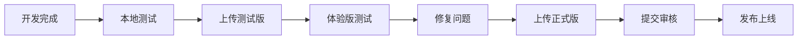
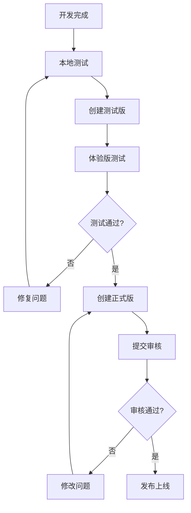

# 🚀 SnakeSnake 发布指南

## 📋 目录

- [发布概述](#发布概述)
- [开发环境配置](#开发环境配置)
- [测试版发布](#测试版发布)
- [正式版发布](#正式版发布)
- [版本管理](#版本管理)
- [发布检查清单](#发布检查清单)

## 🎯 发布概述

SnakeSnake支持两种发布模式：
- **测试版**: 用于内部测试和体验版发布
- **正式版**: 用于正式上线和用户使用

### 发布流程概览



## 🛠️ 开发环境配置

### 1. 微信开发者工具配置

#### 基础配置
1. **下载安装**: 从[微信开发者工具官网](https://developers.weixin.qq.com/miniprogram/dev/devtools/download.html)下载最新版本
2. **登录账号**: 使用微信小程序管理员账号登录
3. **项目配置**: 在`project.config.json`中配置正确的AppID

#### 项目配置示例
```json
{
  "appid": "your-app-id-here",
  "projectname": "SnakeSnake",
  "description": "多人在线贪食蛇大战",
  "setting": {
    "urlCheck": false,
    "es6": true,
    "enhance": true,
    "postcss": true,
    "minified": true
  }
}
```

### 2. 小程序后台配置

#### 服务器域名配置
在微信公众平台后台配置以下域名：

**request合法域名**:
- `https://your-api-server.com` (API服务器)
- `https://your-cdn-server.com` (CDN资源)

**socket合法域名**:
- `wss://your-websocket-server.com` (WebSocket服务器)

#### 业务域名配置
- `https://your-game-server.com` (游戏服务器)

## 🧪 测试版发布

### 1. 本地测试

#### 功能测试
```bash
# 运行单元测试
npm test

# 代码规范检查
npm run lint

# 构建检查
npm run build
```

#### 真机测试
1. 在开发者工具中点击"预览"
2. 使用微信扫码在真机上测试
3. 测试所有核心功能：
   - 游戏启动和初始化
   - 蛇的移动控制
   - 碰撞检测
   - 得分系统
   - 排行榜显示
   - 个人资料页面

### 2. 上传测试版

#### 步骤1: 版本号管理
```bash
# 更新package.json中的版本号
# 例如: "version": "1.0.0-beta.1"

# 创建Git标签
git tag -a v1.0.0-beta.1 -m "Beta version 1.0.0-beta.1"
git push origin v1.0.0-beta.1
```

#### 步骤2: 代码上传
1. 在微信开发者工具中点击"上传"
2. 填写版本号：`1.0.0-beta.1`
3. 填写项目备注：`测试版 - 多人在线贪食蛇大战`
4. 点击"上传"

#### 步骤3: 体验版发布
1. 登录[微信公众平台](https://mp.weixin.qq.com/)
2. 进入"版本管理"页面
3. 找到刚上传的开发版本
4. 点击"选为体验版"
5. 设置体验版二维码

### 3. 体验版测试

#### 测试人员配置
1. **内部测试**: 添加项目成员为体验版用户
2. **外部测试**: 通过体验版二维码邀请外部用户测试

#### 测试反馈收集
- 使用微信小程序后台的"用户反馈"功能
- 建立测试群收集问题反馈
- 使用第三方反馈工具（如腾讯问卷）

## 🚀 正式版发布

### 1. 发布前准备

#### 代码检查
```bash
# 最终测试
npm test
npm run lint
npm run build

# 检查所有功能
- [ ] 游戏核心功能正常
- [ ] 界面显示正确
- [ ] 网络请求正常
- [ ] 错误处理完善
- [ ] 性能优化完成
```

#### 文档更新
- [ ] 更新CHANGELOG.md
- [ ] 检查README.md
- [ ] 更新版本号
- [ ] 准备发布说明

### 2. 上传正式版

#### 步骤1: 版本号更新
```bash
# 更新为正式版本号
# package.json: "version": "1.0.0"

# 创建正式版标签
git tag -a v1.0.0 -m "Release v1.0.0 - 正式版发布"
git push origin v1.0.0
```

#### 步骤2: 代码上传
1. 在微信开发者工具中点击"上传"
2. 填写版本号：`1.0.0`
3. 填写项目备注：`正式版 - 多人在线贪食蛇大战`
4. 点击"上传"

### 3. 提交审核

#### 审核材料准备
1. **小程序介绍**: 详细的功能介绍和使用说明
2. **测试账号**: 提供测试账号和密码
3. **测试视频**: 录制功能演示视频
4. **相关资质**: 如有需要，准备相关资质证明

#### 提交审核
1. 在微信公众平台选择开发版本
2. 点击"提交审核"
3. 填写审核信息：
   - 服务类目选择
   - 功能介绍
   - 测试账号
   - 测试视频
4. 提交审核

### 4. 发布上线

#### 审核通过后
1. 收到审核通过通知
2. 在版本管理页面点击"发布"
3. 确认发布信息
4. 发布成功

#### 发布后监控
- 监控小程序运行状态
- 收集用户反馈
- 处理用户问题
- 准备后续版本更新

## 📋 版本管理

### 版本号规范

采用[语义化版本](https://semver.org/lang/zh-CN/)规范：

```
主版本号.次版本号.修订号[-预发布标识]
```

**示例**:
- `1.0.0` - 正式版
- `1.0.0-beta.1` - 测试版
- `1.0.1` - 修复版本
- `1.1.0` - 功能更新版本

### 版本发布流程



### Git标签管理

```bash
# 创建测试版标签
git tag -a v1.0.0-beta.1 -m "Beta version 1.0.0-beta.1"

# 创建正式版标签
git tag -a v1.0.0 -m "Release v1.0.0"

# 推送标签到远程
git push origin --tags

# 查看所有标签
git tag -l
```

## ✅ 发布检查清单

### 代码质量检查
- [ ] 所有单元测试通过
- [ ] ESLint检查无错误
- [ ] 代码覆盖率达标
- [ ] 性能测试通过

### 功能测试检查
- [ ] 游戏核心功能正常
- [ ] 用户界面显示正确
- [ ] 网络请求和响应正常
- [ ] 错误处理和异常恢复
- [ ] 兼容性测试通过

### 安全检查
- [ ] 敏感信息已加密
- [ ] 用户数据保护
- [ ] 网络安全配置
- [ ] 权限控制正确

### 文档检查
- [ ] README.md更新
- [ ] CHANGELOG.md更新
- [ ] 版本号更新
- [ ] 发布说明准备

### 配置检查
- [ ] 服务器域名配置
- [ ] API接口配置
- [ ] 环境变量配置
- [ ] 小程序配置正确

### 发布准备
- [ ] 测试版验证完成
- [ ] 审核材料准备
- [ ] 发布计划制定
- [ ] 监控方案准备

## 🔧 常见问题

### 1. 上传失败
**问题**: 代码上传失败
**解决方案**:
- 检查网络连接
- 确认开发者工具版本
- 检查项目配置
- 清理缓存后重试

### 2. 审核被拒
**问题**: 小程序审核被拒绝
**解决方案**:
- 仔细阅读拒绝原因
- 修改相关问题
- 重新提交审核
- 必要时联系微信客服

### 3. 发布后问题
**问题**: 发布后出现功能问题
**解决方案**:
- 立即回滚到上一版本
- 分析问题原因
- 修复后重新发布
- 加强测试流程

## 📞 技术支持

### 官方资源
- [微信小程序开发文档](https://developers.weixin.qq.com/miniprogram/dev/framework/)
- [微信公众平台](https://mp.weixin.qq.com/)
- [微信开发者社区](https://developers.weixin.qq.com/community/)

### 项目支持
- **开发者**: JohnyZheng (@zsjohny)
- **邮箱**: zs.johny@163.com
- **GitHub**: https://github.com/zsjohny/snakesnake
- **Issues**: https://github.com/zsjohny/snakesnake/issues

---

**注意**: 发布前请确保所有功能经过充分测试，并准备好相应的文档和说明。 