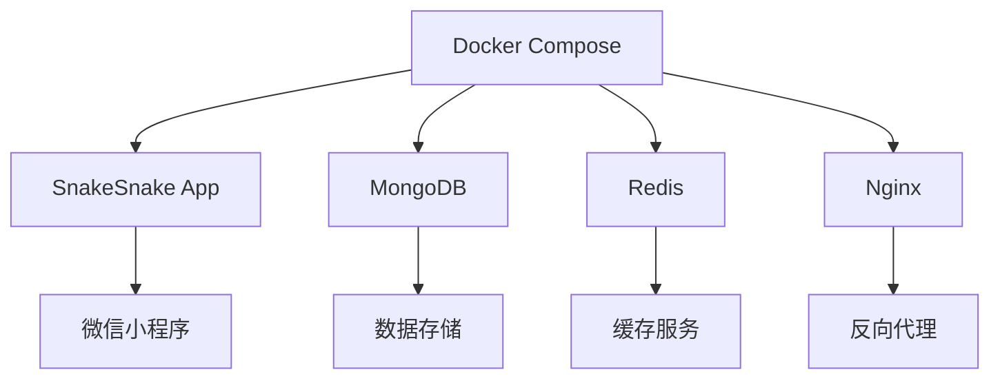

# 🐳 SnakeSnake Docker 使用指南

## 📋 目录

- [Docker 概述](#docker-概述)
- [环境要求](#环境要求)
- [快速开始](#快速开始)
- [开发环境](#开发环境)
- [测试环境](#测试环境)
- [生产环境](#生产环境)
- [常用命令](#常用命令)
- [故障排除](#故障排除)

## 🐳 Docker 概述

SnakeSnake 项目提供了完整的 Docker 支持，包括：

- **多阶段构建**: 支持开发、测试、生产环境
- **容器化部署**: 一键部署整个应用栈
- **环境隔离**: 不同环境使用不同的配置
- **服务编排**: 使用 Docker Compose 管理多个服务

### 架构图



## 🔧 环境要求

### 系统要求

- **Docker**: 20.10+
- **Docker Compose**: 2.0+
- **操作系统**: Linux, macOS, Windows 10/11
- **内存**: 至少 4GB RAM
- **磁盘**: 至少 10GB 可用空间

### 安装 Docker

#### Linux (Ubuntu/Debian)

```bash
# 安装 Docker
curl -fsSL https://get.docker.com -o get-docker.sh
sudo sh get-docker.sh

# 启动 Docker 服务
sudo systemctl start docker
sudo systemctl enable docker

# 添加用户到 docker 组
sudo usermod -aG docker $USER

# 安装 Docker Compose
sudo curl -L "https://github.com/docker/compose/releases/download/v2.20.0/docker-compose-$(uname -s)-$(uname -m)" -o /usr/local/bin/docker-compose
sudo chmod +x /usr/local/bin/docker-compose
```

#### macOS

```bash
# 使用 Homebrew 安装
brew install --cask docker

# 或者从官网下载 Docker Desktop
# https://www.docker.com/products/docker-desktop
```

#### Windows

```bash
# 从官网下载 Docker Desktop
# https://www.docker.com/products/docker-desktop
```

## 🚀 快速开始

### 1. 克隆项目

```bash
git clone https://github.com/zsjohny/snakesnake.git
cd snakesnake
```

### 2. 配置环境变量

```bash
# 复制环境变量模板
cp .env.example .env

# 编辑配置文件
nano .env
```

### 3. 启动开发环境

```bash
# 构建并启动开发环境
docker-compose up --build

# 后台运行
docker-compose up -d --build
```

### 4. 访问应用

- **开发环境**: http://localhost:3000
- **API 文档**: http://localhost:3000/api/docs

## 🛠️ 开发环境

### 启动开发环境

```bash
# 启动开发环境
docker-compose up --build

# 后台运行
docker-compose up -d --build

# 查看日志
docker-compose logs -f snakesnake-dev
```

### 开发环境特性

- **热重载**: 代码修改自动重启
- **调试支持**: 支持断点调试
- **实时日志**: 实时查看应用日志
- **环境变量**: 支持 .env 文件配置

### 开发命令

```bash
# 进入容器
docker-compose exec snakesnake-dev sh

# 运行测试
docker-compose exec snakesnake-dev npm test

# 代码规范检查
docker-compose exec snakesnake-dev npm run lint

# 安装新依赖
docker-compose exec snakesnake-dev npm install package-name
```

## 🧪 测试环境

### 启动测试环境

```bash
# 运行测试
docker-compose --profile test up --build

# 运行测试并退出
docker-compose --profile test run --rm snakesnake-test
```

### 测试环境特性

- **隔离测试**: 独立的测试环境
- **自动化测试**: 自动运行所有测试
- **代码覆盖率**: 生成测试覆盖率报告
- **持续集成**: 支持 CI/CD 集成

## 🚀 生产环境

### 启动生产环境

```bash
# 启动完整生产环境
docker-compose --profile production up -d --build

# 启动基础生产环境（仅应用）
docker-compose up -d snakesnake-prod
```

### 生产环境特性

- **多服务支持**: 应用、数据库、缓存、反向代理
- **负载均衡**: Nginx 反向代理
- **数据持久化**: MongoDB 和 Redis 数据持久化
- **自动重启**: 服务异常自动重启
- **健康检查**: 服务健康状态监控

### 生产环境配置

```bash
# 创建生产环境配置文件
cp .env.example .env.production

# 编辑生产环境配置
nano .env.production

# 使用生产环境配置启动
docker-compose --env-file .env.production --profile production up -d
```

## 📋 常用命令

### 基础命令

```bash
# 构建镜像
docker-compose build

# 启动服务
docker-compose up

# 停止服务
docker-compose down

# 查看服务状态
docker-compose ps

# 查看日志
docker-compose logs

# 重启服务
docker-compose restart
```

### 开发命令

```bash
# 进入开发容器
docker-compose exec snakesnake-dev sh

# 运行测试
docker-compose exec snakesnake-dev npm test

# 代码规范检查
docker-compose exec snakesnake-dev npm run lint

# 安装依赖
docker-compose exec snakesnake-dev npm install

# 构建项目
docker-compose exec snakesnake-dev npm run build
```

### 数据库命令

```bash
# 进入 MongoDB 容器
docker-compose exec mongodb mongosh

# 备份数据库
docker-compose exec mongodb mongodump --out /backup

# 恢复数据库
docker-compose exec mongodb mongorestore /backup

# 进入 Redis 容器
docker-compose exec redis redis-cli
```

### 维护命令

```bash
# 清理未使用的镜像
docker image prune

# 清理未使用的容器
docker container prune

# 清理未使用的网络
docker network prune

# 清理所有未使用的资源
docker system prune

# 查看资源使用情况
docker system df
```

## 🔧 故障排除

### 常见问题

#### 1. 端口冲突

**问题**: 端口 3000 已被占用
**解决方案**:

```bash
# 查看端口占用
lsof -i :3000

# 修改 docker-compose.yml 中的端口映射
ports:
  - "3001:3000"  # 改为其他端口
```

#### 2. 权限问题

**问题**: Docker 权限不足
**解决方案**:

```bash
# 添加用户到 docker 组
sudo usermod -aG docker $USER

# 重启 Docker 服务
sudo systemctl restart docker

# 重新登录或重启系统
```

#### 3. 内存不足

**问题**: 容器内存不足
**解决方案**:

```bash
# 增加 Docker 内存限制
# 在 Docker Desktop 设置中调整内存限制

# 或者使用 swap 文件
sudo fallocate -l 2G /swapfile
sudo chmod 600 /swapfile
sudo mkswap /swapfile
sudo swapon /swapfile
```

#### 4. 网络问题

**问题**: 容器间无法通信
**解决方案**:

```bash
# 重建网络
docker-compose down
docker network prune
docker-compose up --build

# 检查网络配置
docker network ls
docker network inspect snakesnake_snakesnake-network
```

### 日志查看

```bash
# 查看所有服务日志
docker-compose logs

# 查看特定服务日志
docker-compose logs snakesnake-dev

# 实时查看日志
docker-compose logs -f

# 查看错误日志
docker-compose logs --tail=100 | grep ERROR
```

### 性能监控

```bash
# 查看容器资源使用情况
docker stats

# 查看容器详细信息
docker inspect snakesnake-dev

# 查看容器进程
docker-compose exec snakesnake-dev ps aux
```

## 📚 进阶配置

### 自定义 Dockerfile

```dockerfile
# 自定义基础镜像
FROM node:18-alpine AS custom-base

# 安装额外依赖
RUN apk add --no-cache \
    vim \
    htop \
    && rm -rf /var/cache/apk/*

# 设置工作目录
WORKDIR /app

# 复制项目文件
COPY . .

# 安装依赖
RUN npm ci

# 暴露端口
EXPOSE 3000

# 启动命令
CMD ["npm", "start"]
```

### 自定义 Docker Compose

```yaml
# 添加自定义服务
services:
  custom-service:
    image: custom-image
    container_name: custom-container
    ports:
      - '8080:80'
    environment:
      - CUSTOM_VAR=value
    networks:
      - snakesnake-network
```

### 环境变量配置

```bash
# .env 文件示例
NODE_ENV=development
WECHAT_APPID=your-app-id-here
API_BASE_URL=https://your-api-server.com
WEBSOCKET_URL=wss://your-websocket-server.com

# 数据库配置
MONGO_USERNAME=admin
MONGO_PASSWORD=password
MONGO_DATABASE=snakesnake

# Redis 配置
REDIS_PASSWORD=redis-password
```

## 📞 技术支持

### 官方资源

- [Docker 官方文档](https://docs.docker.com/)
- [Docker Compose 文档](https://docs.docker.com/compose/)
- [Docker Hub](https://hub.docker.com/)

### 项目支持

- **开发者**: JohnyZheng (@zsjohny)
- **邮箱**: zs.johny@163.com
- **GitHub**: https://github.com/zsjohny/snakesnake
- **Issues**: https://github.com/zsjohny/snakesnake/issues

---

**注意**: 使用 Docker 前请确保已正确安装 Docker 和 Docker Compose，并了解基本的 Docker 概念和命令。
